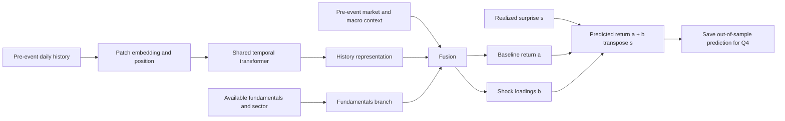

# Q3 Transformer Design Note

**Version:** 0.1 (2026-09-25)  
**Status:** Research design and implementation options; no trained model or empirical result yet.  
**Parent specification:** [question.md](../question.md), Q-spec v1.1.  
**Other methods:** [methods.md](../methods.md).

The main research question is whether a learned representation of firm state predicts
responses to monetary-policy surprises better than explicit financial characteristics.
The transformer is the main architecture to investigate. Q1/DML is a separate workstream
that supplies the treatment definition and aggregate benchmark. This note concentrates
on Q3 and the predictions it must deliver to Q4.

The proposed starting model is a **shared temporal transformer, pretrained on historical
daily sequences, fused with point-in-time fundamentals, and fine-tuned on Fed-event
responses through a state-dependent shock-sensitivity head**. Freezing the encoder is
one transfer-learning experiment, not the permanent design. Joint fine-tuning is part
of the comparison.

The choices below are a research menu, not a Cartesian-product hyperparameter search.
Named papers establish architectural precedents; applying their components to Fed
susceptibility is our proposed adaptation, with performance to be established here.

## 1. Prediction contract

For firm i and scheduled FOMC meeting t:

- **History X_it:** L trading days ending at the trading-day close before t.
- **Firm characteristics c_it:** facts published and available by that same cutoff.
- **Context m_t:** market, sector and macro state available by that cutoff.
- **Shock s_t:** the realized high-frequency surprise for the specified communication window.
- **Target r_it:** adjusted-price return from the previous trading-day close to the event close.
- **Output mu_it:** predicted conditional mean of that return, in original return units.

```text
h_it  = Encoder(X_it)
z_it  = Fuse(h_it, Fundamentals(c_it), Context(m_t))
mu_it = ResponseHead(z_it, s_t)
gap_it = r_it - mu_it                 # computed only after prediction is saved
```

This is a conditional response model using the realized surprise. It is not a
pre-announcement forecast of the surprise, nor an automatically identified firm-level
causal effect. Neither event-day firm returns nor event-day realized market returns
enter the predictor. A model using those inputs would answer a different question.

Daily returns include news outside the announcement window. A full-event surprise is
a natural candidate for this target; statement-only and statement-plus-press-conference
inputs are alternatives to settle jointly with Q1. Do not interchange their units or
interpretations. Absence of a historical press conference is not a measured zero surprise:
use an availability/event-type indicator and define the missing-input policy.

The primary target remains the conditional mean of the raw adjusted-price return.
Factor residuals, ranks, quantiles and relative returns can be secondary outputs or
diagnostics; they must not silently replace it.

## 2. A concrete first transformer

The following is a starting hypothesis, not a tuned configuration or hardware promise.

| Part | Proposed first choice | First alternative |
|---|---|---|
| History | 252 trading days | 126 days; later 504 if coverage supports it |
| Tokens | Non-overlapping 5-day multivariate patches, left padding masked | Single-day tokens or 10-day patches |
| Encoder | 3 pre-norm transformer blocks, width 64, 4 attention heads, FFN width 256 | Width 128 or a small TCN |
| Position | Learned patch-position embeddings | Relative positions or sinusoidal encoding |
| Pooling | Masked mean over patch representations | Last patch, learned query, or summary token |
| Fundamentals | Small two-layer MLP, missingness and age features | Feature tokens with attention |
| Fusion | Concatenation followed by a small MLP | Gated fusion or cross-attention |
| Response head | Separate baseline and shock-loading outputs | Concatenation head, then FiLM |
| Pretraining | Mask approximately 30% of patches; reconstruct observed values within them | Forecasting or contrastive objective |
| Adaptation | Frozen-encoder head training, then unfreeze top block | Full fine-tuning with smaller encoder learning rate |
| Regularization | Dropout 0.1, weight decay, validation early stopping | Tune a small bounded set |
| Loss | Mean of per-meeting mean squared errors | Additional relative-return loss as an ablation |

Use PyTorch or another explicitly selected neural framework at implementation time; the
current project model extras contain statsmodels/scikit-learn, not a transformer stack.
Record the actual parameter count, memory and throughput after the first prototype.



One encoder is shared across firms. A separate transformer per firm would discard
cross-sectional sharing and leave each model with very little event supervision.

## 3. Data representation and information timing

| Input block | Initial candidates | Important implementation detail |
|---|---|---|
| Firm history | Returns, log-volume changes, historical volatility | Avoid raw price levels as the only representation; document split/volume adjustments |
| Relative history | Firm minus market/sector returns, historical beta | Estimate beta using trailing data only; retain raw returns too |
| Market context | Prior market/sector returns, yield changes, volatility | These are historical state inputs, not contemporaneous Q2 channels |
| Firm characteristics | Size, cash, leverage, profitability, valuation | Filing/publication availability governs the join, not fiscal period end |
| Difficult characteristics | Floating-rate debt, maturity schedule, equity duration proxies | Optional until historical coverage and construction are audited |
| Metadata | Sector, observation masks, time since filing, listing age | Historical classifications when available; missingness is explicit |

Start with reliable channels and add families individually. A return-history-only
transformer is a useful first experiment while the fundamental panel is assembled.
An architecture comparison that adds fundamentals must also give those fundamentals
to the tabular baseline.

Fit clipping thresholds and scalers on the historical training partition. Carry
missing-value masks separately from numeric fills; an imputed zero is not an observed
zero return. Right-align histories, mask padding and specify a minimum history length.
Do not invent pre-listing observations. Track which firms are dropped at each meeting.

Per-window normalization can suppress the volatility/scale differences that define
susceptibility. If used, pass trailing means/scales as separate state features and
invert any target transform before scoring. Compare with train-fitted channel scaling.
Global loss in raw return units and volatility-standardized loss weight firms differently;
the latter is an explicitly different training objective, not a neutral preprocessing step.

Quarterly fundamentals are a separate as-of branch initially. Repeating a quarterly
value at every daily token can make stale information appear frequently observed.
An alternative is a sequence of filing tokens with publication dates and age embeddings.
Restated data, revised macro series and current constituent lists require provenance
and scope limitations even when the model's code respects chronological cutoffs.

## 4. Ways to tokenize history

| Design | What attention connects | Benefit to test | Cost or limitation |
|---|---|---|---|
| Daily multivariate tokens | Different historical days | Fine temporal detail; simplest semantics | Quadratic attention in lookback length |
| Multivariate patch tokens | Short blocks containing all channels | Compact sequence; local time patterns | Flattens within-patch structure unless embedding models it |
| Channel-independent patches | Patches within each channel, with shared weights | Strong sharing and separable channel processing | Requires explicit channel fusion to learn cross-variable effects |
| Channel-as-token encoder | Entire histories of different variables | Direct cross-variable interaction | Different bias from temporal attention; long history compressed per variable |
| Multi-scale tokens | Daily/recent and weekly/longer history | Short- and long-horizon state together | More design choices and redundant information |
| Axial temporal/channel attention | Time and variables in separate stages | Factorized interactions without flattening everything | More complex masking, shapes and compute |

[PatchTST](https://arxiv.org/abs/2211.14730) provides the precedent for patching,
channel independence and masked pretraining. Our proposed multivariate-patch starter
is inspired by patching, not a claim to reproduce PatchTST exactly.
[iTransformer](https://arxiv.org/abs/2310.06625) provides a contrasting variable-token
design. Both are options; their forecasting results do not establish finance performance.

Use a bidirectional encoder over the permitted historical window: every observed token
is already in the past relative to the target. A causal attention mask is necessary for
prefix/autoregressive objectives, but not automatically for historical-window encoding.
A decoder-only forecaster is another comparison, although its next-token objective is
less directly aligned with the proposed state-encoding task.

Start with non-overlapping patches. With overlapping patches, hide the underlying masked
values in every overlapping copy; otherwise reconstruction becomes a copying exercise.
Padding, feature missingness and self-supervised masks have different meanings and should
be represented separately.

## 5. Fundamentals, context and fusion

**Late concatenation:** encode history, encode fundamentals, concatenate both with
context and project to z. This is the easiest way to measure each branch's contribution.

**Gated fusion:** learn a state-dependent weighting of the branches. Include missingness
and age so the gate can respond to unavailable or stale fundamentals. Inspect whether
one branch collapses to zero contribution across the sample.

**Feature-token fusion:** represent financial characteristics as typed tokens, then
attend over them and the historical summary. This is flexible but adds parameters and
requires careful treatment of numeric scale and missing features.

**Cross-attention:** let a fundamentals/context query select historical patterns, or let
history query filing tokens. Compare against late fusion with similar parameter budgets.
Do not add both directions initially: the ablation should tell us which interaction helps.

**Separate market-state encoder:** encode the common market history once per meeting,
then share that state across firms. This can reduce redundant computation. Compare with
simply supplying market channels to the firm encoder.

Sector embeddings are reasonable first categorical inputs. Firm-ID embeddings are optional:
they may memorize persistent identities and do not handle unseen firms automatically.
Report both future-meeting performance for known firms and a separate held-out-firm stress
test if claiming transfer to new firms. Never infer unseen-firm generalization from the
standard chronological split alone.

## 6. How the surprise enters the model

### A. State-dependent linear shock head (recommended first)

```text
mu(z, s) = a(z) + b(z)' s
```

The encoder and loading function b can be nonlinear, while the dependence on the shock
is linear conditional on state. With K surprise dimensions, output K loadings and one
baseline. This gives a directly inspectable susceptibility map with relatively few
event-specific parameters. It assumes local linearity, not that all firms respond alike.
Do not impose one coefficient sign on every sector without a separate economic argument.

A multi-shock head needs enough independent variation in every dimension. Collinear
target/path or statement/press-conference inputs can make separate loadings unstable.
Use scaling learned on training data and report loadings in economic units after inversion.
Avoid interpreting a zero-shock prediction far outside observed training support.

### B. Concatenation head

```text
mu(z, s) = MLP(concat(z, s, shock_availability))
```

This is the simplest flexible benchmark. It permits nonlinear shock-state interactions
without committing to a particular conditioning mechanism. It is the appropriate control
for determining whether FiLM adds anything beyond an ordinary nonlinear head.

### C. FiLM conditioning

```text
z_s = gamma(s) * z + beta(s)
mu  = Head(z_s)
```

[FiLM](https://arxiv.org/abs/1709.07871) introduces feature-wise affine conditioning.
Here we propose using the monetary surprise to generate the scales and offsets.
Start after the encoder so ordinary-day representations can be cached and reused.
Later compare conditioning intermediate blocks; that requires rerunning the encoder for
each shock scenario and changes the representation itself. Initialize near identity
if needed to preserve the pretrained state early in adaptation.

### D. Shock tokens and cross-attention

Encode each surprise dimension as a typed token; let a shock query attend to firm-state
tokens, or append shock tokens during event fine-tuning. This can express which parts
of history matter for a given communication shock. It also changes the pretraining/task
interface. With a one-dimensional shock, the extra attention may offer little over an MLP.

### E. Structured nonlinear extensions

Use state-dependent coefficients on a small spline basis of s, separate positive/negative
shock slopes, or a low-rank hypernetwork that produces head weights. These sit between
the linear head and unconstrained conditioning. Regularize toward the linear model and
check shock support by regime. A mixture of experts with a pre-event regime gate is
another later option; it can fragment the already small event sample.

### F. Optional Q1 offset

```text
mu_it = aggregate_baseline_t + firm_deviation(z_it, s_t)
```

An aggregate baseline from Q1 can stabilize the common component only when target window,
units and information sets match. A Q1 intraday coefficient is not directly a daily-return
offset. Fit every offset using the same historical cutoff as Q3; a full-sample DML fit
would leak into historical Q3 predictions. Also compare a freely learned common component.

## 7. Hierarchy, other firms and economic graphs

The default is a multi-branch neural architecture. Statistical multilevel modeling is
an additional option: for example, a common shock loading plus a regularized sector
deviation plus a state-dependent firm deviation. A Bayesian hierarchy can explicitly
model pooling; ordinary sector embeddings alone do not provide posterior uncertainty.

Cross-sectional context can begin with mean/dispersion summaries of pre-event firm states.
Then compare a DeepSets-style pooled context or attention across firm embeddings.
[Set Transformer](https://arxiv.org/abs/1810.00825) is a precedent for attention over sets.
Per-firm predictions should be permutation equivariant: reordering firms should reorder
outputs, not change their values. A pooled meeting summary should be permutation invariant.

All same-meeting inputs must remain pre-event. Sharing pre-event covariates is allowed;
sharing realized event returns would leak the label. With cross-firm attention, batches
must contain the intended meeting universe or a documented sampling approximation.
Test sensitivity to missing constituents and universe changes.

Graph layers can connect supply chains, ownership, credit relationships or historical
return similarity. Economic edges require point-in-time sources; correlation edges must
be built from training/trailing history. The graph adds a data project and is a later
extension, not required for a full transformer study.

## 8. What to pretrain on

Start with earlier ordinary-day windows across many firms, sharing encoder weights.
Define an ordinary-day corpus precisely: initially exclude scheduled FOMC target dates
from reconstruction loss, and record whether their historical observations remain as
context. Excluding all historical policy days is a separate experiment. Do not describe
a corpus as ordinary-day-only if its reconstruction targets include those event days.

| Objective | Task | Why it might help | Main risk |
|---|---|---|---|
| Masked reconstruction | Recover hidden patches/channels | Learn temporal and cross-channel state | Learns interpolation or volatility without transferable susceptibility |
| Short-horizon forecasting | Predict subsequent returns/volatility within training history | Align representation with predictive state | Very noisy return labels; future label must end before cutoff |
| Contrastive views | Align compatible views of the same historical segment | Encourage stable state representations | Augmentations can erase economically meaningful information |
| Denoising | Recover inputs from modest corruption | Robustness to noisy measurements | Unrealistic corruption teaches the wrong invariances |
| Multi-task historical targets | Predict volatility, beta or other predeclared state summaries | Encourage finance-relevant information | Recreates engineered features without improving response prediction |

[TS2Vec](https://arxiv.org/abs/2106.10466) is a reference for contrastive temporal
representation learning, not a transformer requirement. If borrowing its objective,
state that the backbone and downstream task differ. Avoid automatic time reversal,
sign flips or aggressive scaling augmentations: they can destroy direction, volatility
or regime information relevant to this problem.

For masked reconstruction, compute loss only on originally observed masked entries,
balanced across channels. Remove masked values before the encoder; use a small decoder
for reconstruction and discard it for downstream prediction. Scale using training-fitted
statistics; normalization using the hidden target values can undermine the masking task.
Loss should be averaged over observed target counts, not padded tensor size.

Randomly partitioning highly overlapping windows gives an optimistic pretraining validation
score. Split by calendar blocks and ensure objective targets do not cross the cutoff.
Exact deduplication and window sampling should be documented. Pretraining examples sharing
market days are correlated; large row count is not a large independent-shock count.

Auxiliary CPI/payroll/minutes tasks are a later bridge between pretraining and FOMC
fine-tuning. Use event-type embeddings or separate heads; their surprises do not share
units or mechanisms automatically. The held-out FOMC meeting and its press conference
must not enter an auxiliary training task. Test transfer gain rather than assume it.

## 9. Event fine-tuning and adaptation choices

| Setup | Trainable weights | Question it answers |
|---|---|---|
| From scratch | Encoder, branches and head | Is pretraining necessary? |
| Frozen encoder | Fundamentals/fusion/head | Does the representation already transfer? |
| Gradual unfreezing | Head, then top blocks | Can limited task adaptation improve transfer? |
| Full fine-tuning | All weights, smaller encoder learning rate | Is broader adaptation helpful or overfitting? |
| Adapters / LoRA | Small added modules plus head | Can restricted updates capture the needed adaptation? |
| Joint auxiliary training | Event objective plus earlier reconstruction/task losses | Can retained pretraining structure reduce forgetting? |

[LoRA](https://arxiv.org/abs/2106.09685) supplies the low-rank adaptation idea. Its
language-model results are not evidence that it beats full fine-tuning for this small
temporal encoder. Include it only if a parameter-efficient adaptation comparison is useful.

A practical schedule is: pretrain, fit a frozen-encoder head, then unfreeze the top
block and compare validation response loss. Full fine-tuning is a real candidate, not
prohibited. Use a smaller encoder learning rate and preserve the best checkpoint according
to Q3 validation performance. Failed transfer is a result worth recording.

Sample meetings first and firms second, or explicitly weight each firm's loss by the
inverse eligible firm count of its meeting. This prevents meetings with more coverage
from dominating the objective. For a cross-sectional attention model, ordinary independent
firm minibatches are insufficient unless the context approximation is deliberate.

Use gradient clipping, bounded epochs and early stopping. Track gradient norms in the
encoder and head, representation collapse, and train/validation gaps. Compare seeds on
the same splits; favorable initialization is not evidence of an architectural advantage.

## 10. Losses and output heads

The primary loss targets the conditional mean and equal meeting weight:

```text
L_mean = (1 / number_of_meetings) * sum_t [ mean_i (r_it - mu_it)^2 ]
```

**Relative-return auxiliary loss:** compare centered predictions and centered labels
within each meeting. This is legitimate training loss, not permission to supply realized
cross-sectional labels as inference features. It emphasizes firm differentiation alongside
the common response; tune its weight only on earlier validation data.

**Ranking losses:** optional secondary objectives if ordering firms matters. They do not
identify return magnitudes and cannot replace the mean head used for the Q4 gap.

**Huber/absolute losses:** robust alternatives, but their population targets generally
differ from the conditional mean. Keep them as declared variants or retain an MSE-trained
mean output rather than calling every central prediction an expected return.

**Distributional heads:** quantile regression, Gaussian/Student-t likelihoods, or a
mixture density model can characterize response variability. They add assumptions and
optimization choices. For Student-t means require degrees of freedom above one, and
above two for finite variance. A mixture's mean is its probability-weighted component
mean, not its most likely component. Flexible density models/flows are late experiments.

For quantiles, enforce ordering or document crossing correction and measure held-out
coverage. Five quantiles do not uniquely specify a CDF: PIT scoring additionally requires
interpolation and tail assumptions. Save a separate mean output for the primary gap.

Deep ensembles summarize variation across fits; a single predicted variance primarily
models response dispersion. Neither automatically guarantees calibrated uncertainty.
Separate uncertainty in the predicted mean from dispersion of realized returns around it.
Any conformal procedure needs its own event/dependence-aware calibration argument;
ordinary-day calibration alone cannot establish FOMC coverage.

## 11. Chronology across the entire training pipeline

```text
Earlier data                  Later validation          Untouched outer test
pretrain + event training ---> choose architecture ---> freeze and predict meetings
                              and stopping rule         save predictions, then score
```

For inner validation, its encoder checkpoint must also have been pretrained only on
earlier data. Pretraining on validation/test dates without using labels still contaminates
the claim of historical availability. After selection, refit on permitted training plus
validation history before the outer test block, with the protocol already fixed.

Checkpoint choices:

- **One early checkpoint:** pretrain once before all scored evaluation periods. Simple
  and reproducible; may become stale. Include enough history before the earliest validation.
- **Expanding refits:** pretrain separately at successive training cutoffs. More compute,
  but a clean historical comparison.
- **Sequential warm starts:** update checkpoints only forward in time with a fixed update
  rule. Record the entire ancestry; a later checkpoint can never serve an earlier fold.

Fix model weights for each outer test block initially. Updating on earlier test-block
meetings is a distinct online protocol and must be declared before evaluation. New pre-event
histories can still be fed to a frozen model as they become available.

Purge by actual pretraining/auxiliary label end dates, not a blanket number of rows.
Past observations shared between adjacent input windows are normal in forecasting;
future labels entering earlier training are the leakage to prevent. Keep all firms and
communication records belonging to a held-out meeting outside event training.

If using an external pretrained checkpoint, establish its training cutoff and corpus.
A checkpoint containing later market data is unsuitable for a clean historical backtest;
restrict it to a labeled exploratory comparison or genuinely subsequent evaluation.

## 12. Experiments that distinguish the architectural contributions

| Experiment | Comparison with other settings held fixed | Interpretation |
|---|---|---|
| E0 | Pooled/sector, ridge interactions, boosting | Establish the predictive baselines |
| E1 | Summary features vs TCN vs transformer | Does temporal representation add value? |
| E2 | Transformer from scratch vs pretrained frozen | Does pretraining transfer? |
| E3 | Frozen vs partial vs full fine-tuning | How much task adaptation helps? |
| E4 | History only vs fundamentals only vs fused | Which information source contributes? |
| E5 | State-only vs shock-conditioned | Does the surprise add useful information? |
| E6 | Linear shock head vs concatenation vs FiLM | Does nonlinear conditioning help? |
| E7 | Common return accuracy vs within-meeting centered accuracy | Is improvement actually firm-specific? |
| E8 | Add pooled context, then cross-firm attention | Does peer state add incremental value? |
| E9 | Mean-only vs mean plus distributional tasks | Does uncertainty modeling help or distract? |

Run E0-E6 in stages, not every combination. An initially null linear baseline does not
logically rule out nonlinear signal; the baselines provide reference points rather than
a prohibition on training the encoder. Use the same eligible sample for paired comparisons,
and separately report coverage gained/lost by input availability.

Primary metric: mean per-meeting MSE in original return units. Secondary: RankIC, centered
MSE, regime/sector stability and quantile diagnostics when applicable. Predeclare handling
of constant predictions or tiny cross-sections where RankIC is undefined; do not silently
drop bad meetings. Compare paired meeting losses with serial-dependence-aware uncertainty.

Report a few fixed seeds rather than the best seed, and include parameter count, runtime
and tuning budget. Set practical gain thresholds after a pilot/power assessment but before
the final evaluation. The number of future independent shocks remains small even when
the training tensor contains many firm rows.

Q4 reversal, Sharpe ratios and strategy P&L never select the Q3 architecture. A stronger
Q3 model may make reversal weaker by explaining previously predictable returns. That is
compatible with success on the actual response-prediction question.

## 13. Diagnostics and visualization ideas

| View | What it should reveal | Interpretation limit |
|---|---|---|
| Architecture and tensor shapes | Which branch sees which information, and when | Helps audit the model rather than validate performance |
| Train/validation curves by training stage | Transfer gain, forgetting, overfitting | Reconstruction improvement is not downstream improvement |
| Per-meeting loss differences | Which meetings drive gains over boosting | Aggregate gains can depend on a few large shocks |
| Predicted vs realized returns | Calibration and sector patterns | Show all outer-test observations, not selected examples |
| Susceptibility over time | State-dependent b(z), with sector summaries | Predictive loading, not established causal effect |
| Shock-response curves for fixed states | Linear vs nonlinear conditioning behavior | Restrict to observed support; scenario curves are not causal counterfactuals |
| Embedding projection and probes | Whether state encodes sector, volatility, leverage | A visually separated embedding is not proof of economic discovery |
| Branch/input removal | Whether history and fundamentals carry incremental signal | Correlated inputs complicate attribution |
| Quantile coverage by regime | Distributional calibration and breakdowns | Conditional coverage may be noisy with few meetings |
| Out-of-sample gap distributions | How model errors differ from ordinary-day residuals | Large gaps are not automatically mispricing |

Fit embedding projections on training representations and transform held-out ones when
making out-of-sample visual claims. Attention maps are useful internal diagnostics, not
causal explanations or reliable standalone feature importance. Pair them with actual
removal/perturbation experiments. Keep a historical-cutoff selector in any model explorer.

## 14. Implementation outline and Q4 handoff

Suggested modules (now split between `core/fedcore/q3/`, shared, and the `encoder/` and `cde/` projects; see their HANDOFF docs):

```text
features.py             # point-in-time joins, input/target definitions
datasets.py             # windows, masks, meeting batches, fold cutoffs
models/encoder.py       # patching, transformer, pooling
models/fusion.py        # fundamentals and optional context branches
models/heads.py         # sensitivity, concatenation, FiLM, optional quantiles
pretrain.py             # ordinary-day objective and checkpoint lineage
train.py                # event adaptation and inner validation
evaluate.py             # common metrics, paired meeting comparisons
pipeline.py             # orchestration and ResultStore registration
```

This is a proposed layout, not files implemented by this note. Keep Q3-specific code
here; reusable date-split/data utilities belong in the shared packages. Inspect the
existing ResultStore contract before adding checkpoint storage or new artifact types.

Save one prediction row per eligible firm-meeting with stable firm identifier, meeting
date, target-window definition, feature cutoff, model training cutoff, model/run/fold ID,
shock definition and units, predicted mean, realized return and signed gap. Optional
columns include b(z), predicted quantiles, masks/coverage flags and pre-event scale.
Keep target/realized fields separate from model inputs throughout the pipeline.

Accompany the predictions with input dataset hashes, universe rules, scaler parameters,
configuration, random seed, training/validation meeting IDs and checkpoint ancestry.
Q4 should consume saved out-of-sample predictions; it should not silently refit Q3 to
improve a reversal result. The independent ordinary-day benchmark stays a comparison.

Before real-data conclusions, verify temporal cutoffs, masking, inverse transforms,
meeting weighting, deterministic checkpoint reload and absence of target columns in
features. For set layers verify permutation behavior. Use synthetic known-response panels
to check recovery, plus noise/no-reversal cases so a successful encoder does not imply a
manufactured downstream effect. These are future implementation checks, not tests already run.

## 15. Build sequence and decisions to settle

1. Agree with Q1 on surprise units/window and the available historical meeting spine.
2. Build the return-history dataset, masks and chronological experiment partitions.
3. Train the basic patch transformer on historical reconstruction; inspect representations.
4. Fit the structured response head and compare scratch, frozen and fine-tuned encoders.
5. Add fundamentals with a same-sample tabular comparison, then test concatenation/FiLM.
6. Publish the Q3 prediction/ablation results and saved outer-test predictions.
7. Add distributional or cross-firm modeling only for a clear additional hypothesis;
   let Q4 independently evaluate the resulting gaps.

The open choices are the shock/window alignment, historical universe and feature coverage,
pretraining cutoff strategy, practical validation-gain threshold, compute budget and final
encoder size. The proposed configuration gives us a concrete place to start without
pretending these choices have already been empirically settled.

The central comparison is **engineered firm characteristics versus learned temporal state,
then their combination**. The encoder is the research contribution; Q4/Q5 are possible
applications of its held-out errors, not conditions for doing the encoder work.
